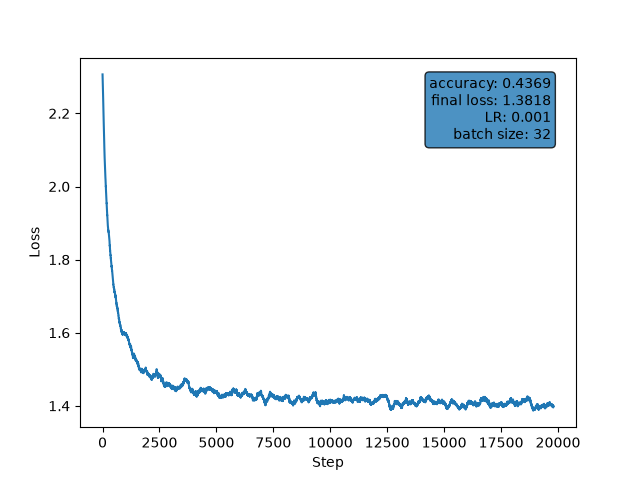

## np_nn

- mlp implemented (no huge correlation between shopping behavior & marital status ;() )

*testing out different neural network architectures & proving myself that all of that are just math models*
